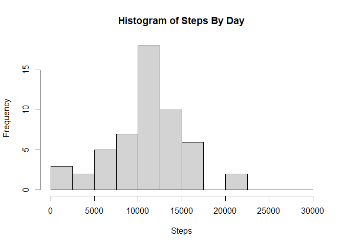
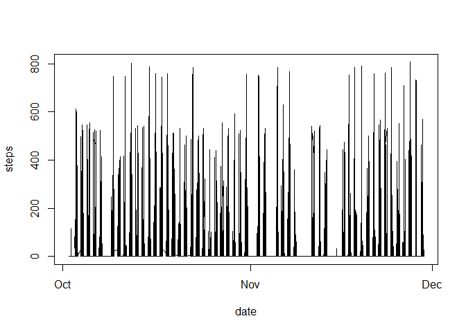
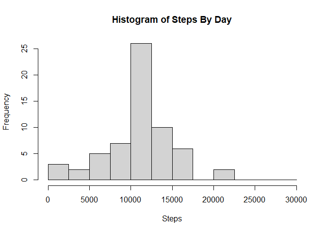
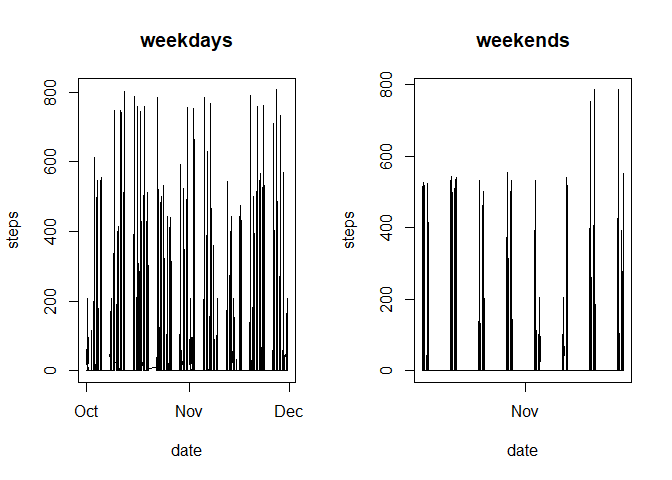

## 1. Downloading and cleaning the data

read in the data using read.csv function


```r
library(readr)
raw <- read.csv('./repdata_data_activity/activity.csv')
```

#clean up data, namely, removing NAs


```r
data <- raw[!is.na(raw$steps),]
```

#import necessary packages and make dataset that groups data by date


```
## 
## Attaching package: 'dplyr'
```

```
## The following objects are masked from 'package:stats':
## 
##     filter, lag
```

```
## The following objects are masked from 'package:base':
## 
##     intersect, setdiff, setequal, union
```

#group data by date


```r
data.by_date <- data %>%
  group_by(date) %>%
  summarise(steps = sum(steps))
```

```
## `summarise()` ungrouping output (override with `.groups` argument)
```

```r
data$interval.time <- format(strptime(substr(as.POSIXct(sprintf("%04.0f", data$interval),format="%H%M"), 12, 16), '%H:%M'), '%I:%M %p')
data$date_detail <- as.POSIXct(paste(data$date, data$interval.time), format="%Y-%m-%d %H:%M %p")
data$date <- as.Date(data$date)
```

## 2. Histogram


```r
hist(data.by_date$steps,breaks = seq(0,30000,2500),
     main = "Histogram of Steps By Day",xlab = "Steps")
```

<!-- -->

## 3. Mean and Median Steps Taken Per Day


```r
print("mean:")
```

```
## [1] "mean:"
```

```r
mean(data.by_date$steps)
```

```
## [1] 10766.19
```

```r
print("median:")
```

```
## [1] "median:"
```

```r
median(data.by_date$steps)
```

```
## [1] 10765
```

## 4.Plot time series of steps taken


```r
plot(x = data$date_detail, y = data$steps,type="l",xlab="date",ylab="steps")
```

<!-- -->

## 5. 5 min interval with max steps

```r
print("Date and interval of max steps:")
```

```
## [1] "Date and interval of max steps:"
```

```r
paste(data[which.max(data$steps),]$date,data[which.max(data$steps),]$interval,sep=" ")
```

```
## [1] "2012-11-27 615"
```
## 6. Imputing Missing Data

#Goal is to impute data with average value for each interval.  Step 1 is make a table with these average values


```r
avg.by.interval <- data %>% group_by(interval) %>% summarize(Mean.steps = mean(steps))
```

```
## `summarise()` ungrouping output (override with `.groups` argument)
```

Loop over raw data and impute values if there is an NA, flag imputed values as 1 in impute flag column, else 0.   

```r
raw$impute.flag <- 0
for (i in seq(1,nrow(raw))){
  if (is.na(raw$steps[i])){
      raw$steps[i] <- avg.by.interval$Mean.steps[[match(raw$interval[i],avg.by.interval$interval)]]
      raw$impute.flag[i] <- 1
  }
}
```

## 7. Histogram with imputed values

#rebuild data dataframe with imputed raw dataset

```r
data <- raw
```

group data by date


```r
data.by_date <- data %>%
  group_by(date) %>%
  summarise(steps = sum(steps))
```

```
## `summarise()` ungrouping output (override with `.groups` argument)
```

```r
data$interval.time <- format(strptime(substr(as.POSIXct(sprintf("%04.0f", data$interval),format="%H%M"), 12, 16), '%H:%M'), '%I:%M %p')
data$date_detail <- as.POSIXct(paste(data$date, data$interval.time), format="%Y-%m-%d %H:%M %p")
data$date <- as.Date(data$date)
```

#build histogram


```r
hist(data.by_date$steps,breaks = seq(0,30000,2500),
     main = "Histogram of Steps By Day",xlab = "Steps")
```

<!-- -->

## Panel plot weekends vs weekday

#Create weekend and weekdaya datasets

```r
library(timeDate)
data$weekday <- isWeekday(data$date)
weekday <- data[data$weekday,]
weekend <- data[!data$weekday,]
```

#make plots

```r
par(mfrow=c(1,2))
plot(x = weekday$date_detail, y = weekday$steps,type="l",xlab="date",ylab="steps",main="weekdays")
plot(x = weekend$date_detail, y = weekend$steps,type="l",xlab="date",ylab="steps",main="weekends")
```

<!-- -->

